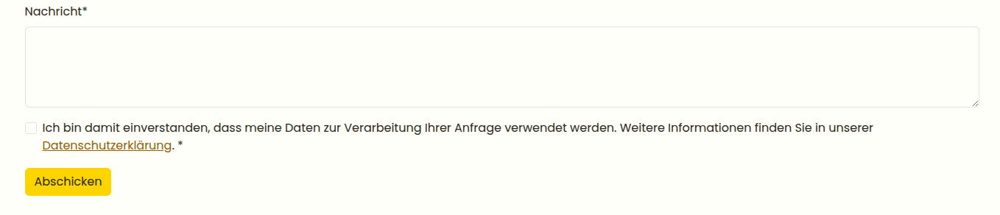

# Form Field Collection Bundle

This bundle adds additional form fields to the Contao form generator.

## Fields
* Date/Time field - Field of html type date or time with native pickers (if supported by browser)
* Single Checkbox field - A single checkbox with a rich-text option label and configurable submitted value
* Success Message Field - Displays a success message after form submission

## Installation

Install the bundle via composer and update your database afterwards:

```
composer require heimrichhannot/contao-form-fields-collection-bundle
```

## Usage

After install you'll find new form field types. 

### Date/Time field


Select the field type "Date/ time" and select the format (date or time). 


### Success Message field

Select the field type "Success Message" and enter the message you want to display after form submission.


### Single Checkbox field

Select the field type "Checkbox Single". Then configure the checkbox label in the `text` field and, if needed, define a custom submitted value in the `value` field. If no value is set, the checkbox submits `1`.

Like other Contao form fields, you can also mark the checkbox as mandatory and provide a help text.



#### Customize

The template is made to be customized:

```php
// Make it a bootstrap one:
<?php $this->extend('form_huh_single_checkbox');

$this->option_wrapper_element = 'div';
$this->wrapperElementAttributes = $this->attrs()->addClass('form-check')->mergeWith($this->wrapperElementAttributes ?: []);
$this->checkboxAttributes = $this->attrs()->addClass('form-check-input')->mergeWith($this->checkboxAttributes ?: []);
```