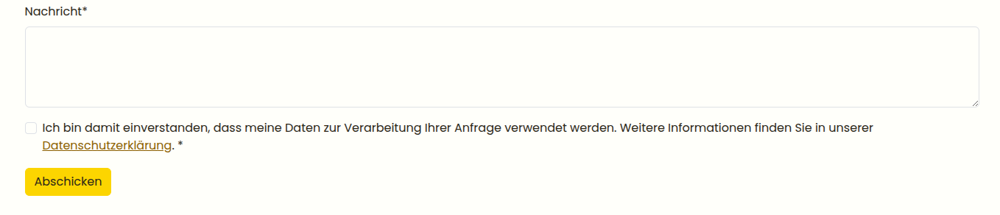

# Form Field Collection Bundle

This bundle adds additional form fields to the Contao form generator.

## Fields

* Date/Time field - Field of html type date or time with native pickers (if supported by browser)
* Single Checkbox field - A single checkbox with a rich-text option label and configurable submitted value

## Installation

Install the bundle via composer and update your database afterwards:

```bash
composer require heimrichhannot/contao-form-fields-collection-bundle
```

## Usage

After installation, the additional field types are available in the Contao form generator.

### Date/Time field


Select the field type "Date/ time" and select the format (date or time).


### Single Checkbox field

Select the field type "Checkbox Single". Then configure the checkbox label in the `text` field and, if needed, define a
custom submitted value in the `value` field. If no value is set, the checkbox submits `1`.

Like other Contao form fields, you can also mark the checkbox as mandatory and provide a help text.



#### Templates and customization

Twig templates are provided under `contao/templates/twig/` and follow Contao's core form templates:

| Template | Purpose |
|----------|---------|
| `form_huh_datetime.html.twig` | Date/time field; inherits from the widget's configured parent template (`form_text` by default) |
| `form_huh_single_checkbox.html.twig` | Single checkbox with a rich-text option label |
| `form_huh_single_checkbox_bs5.html.twig` | Bootstrap 5 single checkbox variant |
| `form_huh_successMessage.html.twig` | Compatibility template extending Contao's explanation template |

The success-message template does not reintroduce the `SuccessMessageWidget` removed in 0.2.0.
The existing `.html5` templates remain available. New customizations should use Twig.

The single-checkbox templates support these variables:

| Variable | Description |
|----------|-------------|
| `option_wrapper_element` | Wrapper tag; defaults to `span` (`div` in the Bootstrap 5 variant) |
| `option_wrapper_attributes` | Option wrapper attributes, built with `attrs()` |
| `checkbox_attributes` | Checkbox input attributes, built with `attrs()` |
| `label_attributes` | Option label attributes, built with `attrs()` |
| `error_wrapper_element` | Error wrapper tag; defaults to `p` |
| `error_wrapper_attributes` | Error wrapper attributes, built with `attrs()` |
| `invisible_class` | Twig-only class for visually hidden mandatory-field text; defaults to `invisible` (`visually-hidden` in the Bootstrap 5 variant) |

To use the Bootstrap 5 variant as the project default, create this override in your project's Twig root:

```twig
{# contao/templates/twig/form_huh_single_checkbox.html.twig #}

```

The Bootstrap variant adds `form-check`, `form-check-input`, and `form-check-label` classes.
It extends the bundle's base template through its bundle-specific namespace so that the project override does not create circular inheritance.
Bootstrap CSS must be provided by your project.

Additional attributes can be set in the same override:

```twig




```

## Upgrading from 0.2.2 to 0.3.0

Update PHP and Contao to the required versions before upgrading the bundle.
The following deprecated template variables are no longer read, in either PHP or Twig templates:

| Removed variable | Replacement |
|------------------|-------------|
| `errorAttributes` | `error_wrapper_attributes` |
| `wrapperElementAttributes` | `option_wrapper_attributes` |
| `checkboxAttributes` | `checkbox_attributes` |

Update custom templates to use the replacements. Local PHP variables are unaffected; this change concerns the widget/template customization properties.

Existing overrides that explicitly extend a `.html5` template continue to use that legacy template.
Change the parent reference to its `.html.twig` counterpart to adopt the Twig version.
The backend `be_tinyMCE_option.html.twig` template now lives in the bundle's Twig root; its template name is unchanged.
Clear Contao's cache after updating so template discovery picks up the new files.

## Development

Install development dependencies in the bundle directory, then run:

```bash
composer install --no-plugins
vendor/bin/rector process --dry-run --no-progress-bar
vendor/bin/phpstan analyse --no-progress
vendor/bin/ecs check --no-progress-bar
```

The toolchain targets PHP 8.4. Rector uses PHP 8.4 rules, explicit Contao migration sets, and Composer-based Symfony/Doctrine rules.
PHPStan checks at level 4 with PHP 8.4 as its target. ECS uses PSR-12 and its prepared formatting sets.
CI runs these checks on PHP 8.4.
